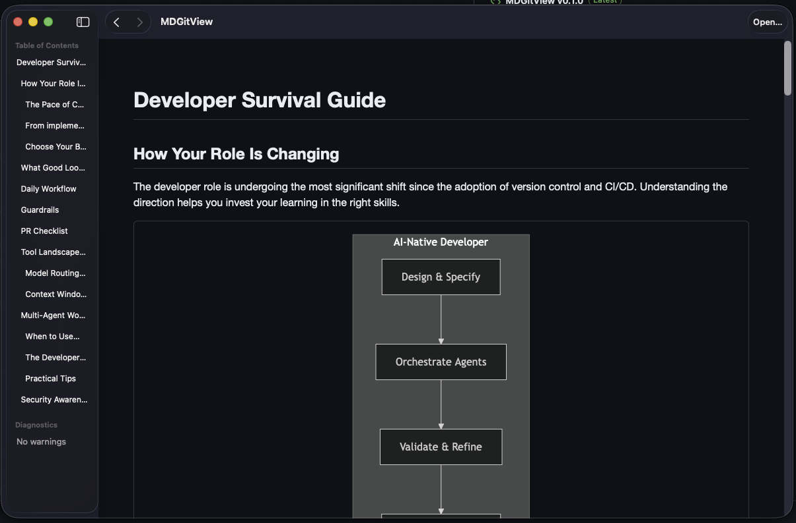

# MDGitView

macOS Markdown viewer with a Rust rendering core and SwiftUI + Quick Look integration.
Browse markdown files in your projects like you would on GitHub — with Mermaid diagrams, table of contents, and link navigation between documents.

**Created by Toni Hintikka together with Codex 5.3 and Claude Code (Opus 4.6).**



## Installation

1. Download the latest `.app` from [GitHub Releases](https://github.com/tonihintikka/MDGitView/releases)
2. Unzip and drag `MDGitView.app` to `/Applications`
3. Open the app once — macOS requires this to activate the Quick Look extensions
4. Done! You can now preview `.md` files with Quick Look in Finder

> **Note:** On first launch, macOS may show a security dialog. Click "Open" to allow the app to run. If the dialog says the app "can't be opened", go to System Settings > Privacy & Security and click "Open Anyway".

## Features

- **GitHub-style rendering** — tables, task lists, autolinks, fenced code blocks
- **Mermaid diagrams** — rendered directly in the viewer
- **MathJax** — mathematical notation support
- **Table of Contents** — auto-generated sidebar from headings
- **Dark mode** — adapts to your system appearance
- **Link navigation** — click links between markdown files in the same project
- **Local images** — relative image paths resolve correctly
- **HTML sanitization** — unsafe content is filtered out

## Quick Look

MDGitView includes a Finder Quick Look extension. Select any `.md` file in Finder and press **Space** to see a full rendered preview — including Mermaid diagrams and styling.

The preview includes an **"Open in MDGitView"** button (top-right corner) to quickly open the file in the full app.

### Quick Look troubleshooting

If Quick Look doesn't show the rendered preview:

1. Make sure you've opened MDGitView.app at least once
2. Check System Settings > Privacy & Security > Extensions > Quick Look — MDGitView should be enabled
3. Reset the Quick Look cache:
   ```
   qlmanage -r
   ```
4. Test from terminal:
   ```
   qlmanage -p /path/to/file.md
   ```

## Usage

### Opening files

- **Drag & drop** a `.md` file onto the app icon
- **File > Open** (or **Cmd+O**) to browse for a file
- **Double-click** a `.md` file in Finder (if MDGitView is set as default)

### Keyboard shortcuts

| Shortcut | Action |
|----------|--------|
| Cmd+O | Open file |
| Cmd+R | Refresh document |
| Cmd+E | Open in external editor |
| Shift+Cmd+R | Reveal in Finder |
| Cmd+[ | Navigate back |
| Cmd+] | Navigate forward |

### Setting as default Markdown viewer

Right-click any `.md` file in Finder > Get Info > Open With > select MDGitView > click "Change All".

## Building from source

See [DEVELOPMENT.md](DEVELOPMENT.md) for build instructions, project layout, and contributing guidelines.

## Open source credits (Mermaid)

Mermaid diagram rendering in MDGitView is powered by the vendored Mermaid runtime in `md-viewer-macos/Resources/Assets/mermaid.min.js`.

- [Mermaid](https://github.com/mermaid-js/mermaid) (v11.12.2) - MIT
- [DOMPurify](https://github.com/cure53/DOMPurify) (bundled via Mermaid) - Apache-2.0 / MPL-2.0
- [js-yaml](https://github.com/nodeca/js-yaml) (bundled via Mermaid) - MIT
- [lodash-es](https://github.com/lodash/lodash) (bundled via Mermaid) - MIT
- [cytoscape.js](https://github.com/cytoscape/cytoscape.js) (bundled via Mermaid) - MIT

Version and bundled license details were verified from `md-viewer-macos/Resources/Assets/mermaid.min.js`.

## License

MIT
