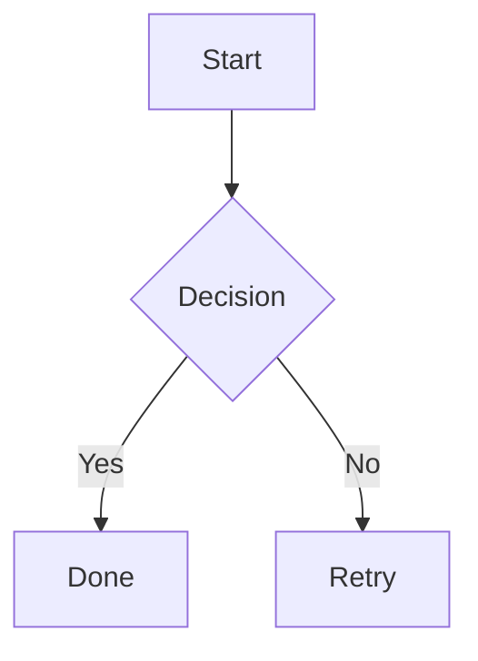

# Sample Document

This is a **Markdown** sample with a [local image](diagram.png) and a [blocked reference](../secret.md).

- [x] render checklist
- [ ] keep editor for later

## Diagram

## Math

Inline: $E = mc^2$

Block:

$$
\int_0^1 x^2 dx = \frac{1}{3}
$$

| Feature | Status |
| --- | --- |
| GFM Tables | Ready |
| Quick Look | Scaffolded |
